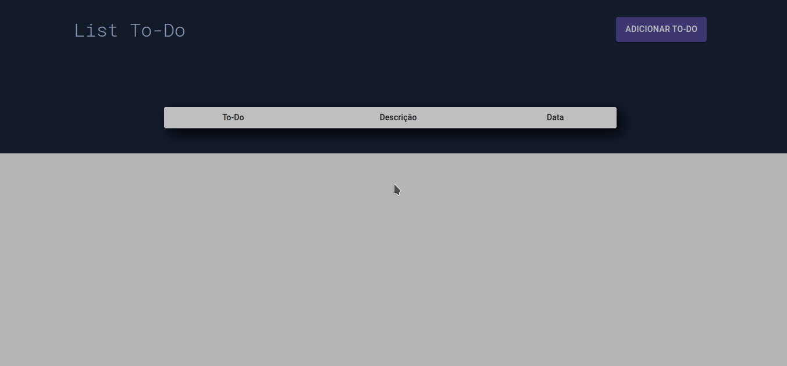

# List To-Do :heavy_check_mark:

Simple Aplication With ReactJS and Typescript is a list of tasks, of things that need to be done.

> Status: Developing.

In this project, we have three informations: 
+ Name of the Task
+ Description 
+ Date 
## Technologies
+ ReactJS
+ TypeScript
+ HTML
+ CSS -> Styled-Components
+ MirageJS
+ Material-UI

## How to run the Application

1. Set `yarn` to download of dependencies.
2. Set `yarn start` in the folder of the project.

